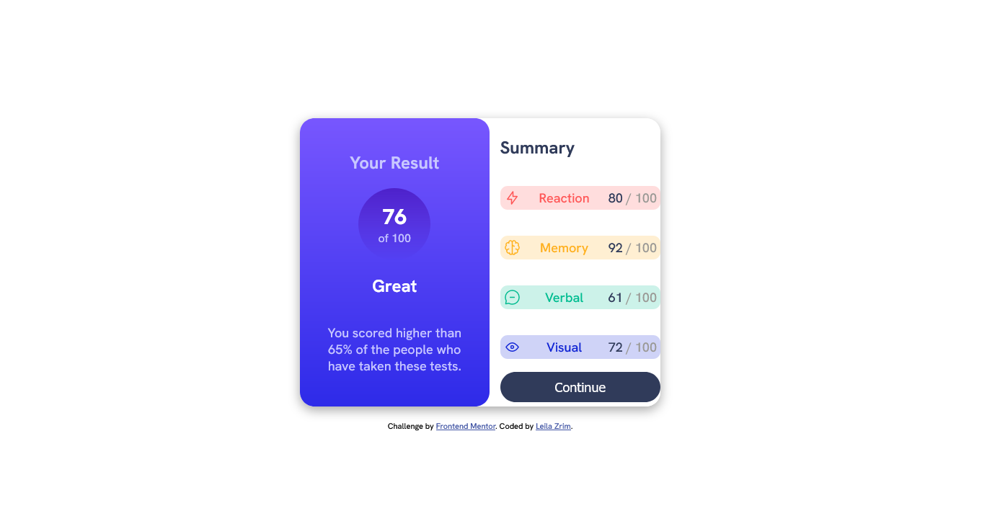

# Frontend Mentor - Results summary component solution

This is a solution to the [Results summary component challenge on Frontend Mentor](https://www.frontendmentor.io/challenges/results-summary-component-CE_K6s0maV). Frontend Mentor challenges help you improve your coding skills by building realistic projects. 

## Table of contents

- [Overview](#overview)
  - [The challenge](#the-challenge)
  - [Screenshot](#screenshot)
  - [Links](#links)
- [My process](#my-process)
  - [Built with](#built-with)
  - [What I learned](#what-i-learned)
  - [Continued Development](#continued-development)
- [Author](#author)

## Overview

### The challenge

Users should be able to:

- View the optimal layout for the interface depending on their device's screen size
- See hover and focus states for all interactive elements on the page

### Screenshot

### Links

- Solution URL: [Code](https://github.com/leila0202/results-summary-component-main)
- Live Site URL: [Live Site](https://leila0202.github.io/results-summary-component-main/)

## My process

### Built with

- Semantic HTML5 markup
- Flexbox

### What I learned

I learned how/when to use flexbox

### Continued development

I'm going to implement responsive design for mobile and getting the design closer to the example. And I'm going to try to get more structure in the css and html.

## Author

- Frontend Mentor - [@leila0202](https://www.frontendmentor.io/profile/leila0202)
